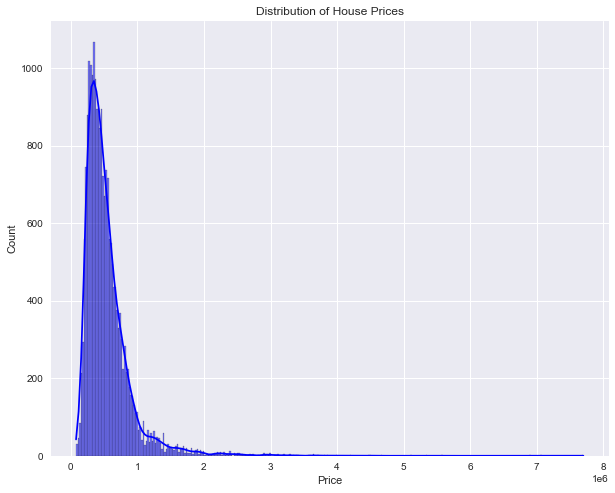
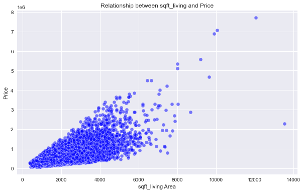
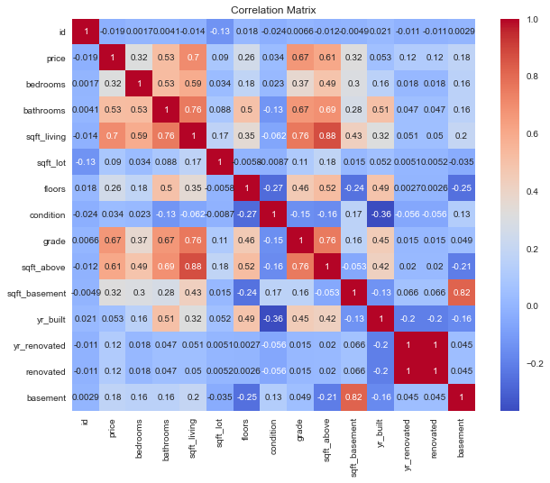

# REAL ESTATE REGRESSION ANALYSIS

## OVERVIEW

The real estate industry plays an important role in the economic landscape of the northwestern county, contributing significantly to the region's growth and development. As an integral part of the local economy, the housing market in this area is influenced by a multitude of factors, including the desirability of the location, property size, amenities, and prevailing market trends. King County is a prominent county in the state of Washington, United States. It is known for its robust real estate market, characterized by diverse housing options, including single-family homes, condominiums, and townhouses.

## Business Understanding

The real estate industry in King County, Washington, is a key driver of the region's economic growth, fueled by factors like location desirability and diverse housing options. Strong demand is supported by a thriving economy, major tech companies, and attractive amenities in this picturesque area
As much as the real estate market in King County is booming, there are no clear and actionable insights on the specific factors that drive the the property prices in the local housing market. Scarcity of such vital information hampers the ability of real estate investors to navigate the market and make informed decisions.
To address this critical gap, there need for data driven solutions that unravel the intricacies of the King County housing market providing investors with the information they need to improve their knowledge in the local housing market. This will provide knowledge to investors on the interplay of factors affecting property prices and be able to predict the expected price of homes and boost their confidence to make sound real investment and property decisions.
The challenge is to establish a robust data analysis framework that addresses the complexities including data preparation, exploratory data analysis and regression modeling. Our aim is to offer or provide homeowners and real estate professionals with dependable insights for navigating the ever-changing King County real estate market with confidence.

### Objectives

* To determine the main features that affect the value of a home.
* To check if there is a differnce in the price of the renovated houses and those that were not renovated
* Quantify the effect of the above features on the value of a home.
* To Develop a model to predict the home value.

## Data Understanding

This project uses King County house sales dataset which can be found in [kc_house_data.csv.](./data/kc_house_data (1).csv)

This data contains information about the houses in the northwestern county.
The columns are described better in the [column_names](./data/column_names.md) file

The data contains 21 columns and 21597 rows, the columns are data on 'id', 'date', 'price', 'bedrooms', 'bathrooms', 'sqft_living', 'sqft_lot', 'floors', 'waterfront', 'view', 'condition', 'grade', 'sqft_above', 'sqft_basement', 'yr_built', 'yr_renovated', 'zipcode', 'lat', 'long', 'sqft_living15', and 'sqft_lot15'

## Data Analysis

For our data analysis we focused on the features and how they correlate with price.

We first checked the distribution of our target variable which is price

The data is seen to be positively skewed

We then checked the feature that had the highest correlation with price and plotted a scatter plot

There is a positive correlation between living space area and the price

And finally plotted a correlation matrix to help us in choosing the features for our model

Positive correlations: Features like the number of bathrooms, 'sqft_living', grade, and the square footage of the house 'sqft_above' are positively correlated with house prices. This suggests that houses with more bathrooms, larger living spaces, higher grades, and more above-ground space tend to have higher prices.

Features like 'yr_built' (year built), 'yr_renovated', 'sqft_lot' have weaker correlations with 'price,' suggesting that these variables may have a less direct influence on house prices.

## Modeling

For the modelling we started with splitting the data, for training and testing, then had a baseline model, from our data analysis the feature with the highest correlation with price is 'sqft_living' and so we used that for our baseline model. We then moved on to creating a multiple regression model and finding the best model to answer our last objective which is developing a model to predict home value. Another 
technique used was recursive feature elimination.

Modeling Approach: We employed a multiple linear regression model to predict home prices based on a set of independent variables. This choice was made because it allows us to capture the relationships between various property features and their effects on price.

Recursive Feature Elimination: This was done to find the most important features that impact price of a house

## Regression Results

Key Findings: The model explains 64% of the variation in home prices. The most influential features include square footage, house condition, view quality, renovation status, waterfront access, and the number of bedrooms.

Coefficient Analysis: At an average value of all the features the price of the houses is 340300 dollars.

For each increase of 1 square foot of sqft_living, we see a change of 202800 + (25830 x sqft_living) in price.

For each one-unit increase in house condition, from Poor to Fair or from Good to Very Good, there is an associated 49030 dollars increase in the predicted house price. 

Houses that were renovated have a predicted increase in price of 129800 dollars compared to houses that were not renovated, holding all other factors constant. 

For bedrooms an increase in the number of bedrooms leads to a decrease in price by 30530 dollars

## Conclusion  

Conclusion: Our analysis provides valuable insights into the factors affecting home prices, allowing stakeholders to make informed decisions regarding property investments and pricing strategies.

Recommendations: We recommend prioritizing property renovation and enhancing features like views and waterfront access to maximize property value. Regularly update and retrain the model for long-term predictive accuracy.

The group [presentation](GROUP 3 PHASE 2 PRESENTATION_3.pdf) 

